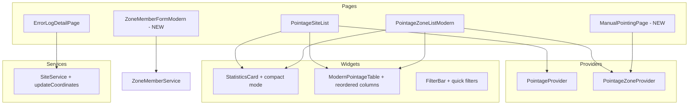

# Design Document: Pointage UI Improvements

## Overview

Ce document décrit la conception technique pour améliorer l'interface utilisateur des pages de pointage dans SPAS-Web. Les améliorations couvrent 8 domaines principaux: correction des filtres, réorganisation des colonnes, mise à jour des coordonnées depuis les erreurs, finalisation de la migration zone, uniformisation des boutons, migration du pointage manuel vers une page dédiée, modernisation du formulaire chef de zone, et amélioration des statistiques.

## Architecture

### Architecture Existante

L'application utilise une architecture moderne basée sur:
- **Provider Pattern**: Gestion d'état avec `PointageProvider` et `PointageZoneProvider`
- **Repository Pattern**: Accès aux données via `PointageRepository` et `PointageZoneRepository`
- **Design System**: Composants réutilisables (`PointageColors`, `PointageSpacing`, `PointageTextStyles`)
- **Cache Manager**: Gestion du cache pour optimiser les performances

### Modifications Architecturales



## Components and Interfaces

### 1. FilterBar Enhancement (Requirement 1)

**Problème actuel**: Le dialog de période ne se ferme pas automatiquement et le filtre "Aujourd'hui" ne s'applique pas.

**Solution**: Ajouter des quick filters et corriger la logique de fermeture du dialog.

```dart
/// Enhanced FilterBar with quick date filters
class FilterBar extends StatelessWidget {
  // Existing properties...
  final VoidCallback? onTodayFilter;
  final VoidCallback? onThisWeekFilter;
  final VoidCallback? onThisMonthFilter;
  
  Widget _buildQuickFilters() {
    return Row(
      children: [
        _QuickFilterChip(
          label: "Aujourd'hui",
          isSelected: _isTodaySelected,
          onTap: () {
            final today = DateTime.now();
            final todayRange = DateTimeRange(
              start: DateTime(today.year, today.month, today.day),
              end: DateTime(today.year, today.month, today.day, 23, 59, 59),
            );
            onFiltersChanged?.call(filters.copyWith(dateRange: todayRange));
          },
        ),
        // ... other quick filters
      ],
    );
  }
}
```

### 2. ModernPointageTable Column Reordering (Requirement 2)

**Nouvel ordre des colonnes**: Superviseur, Site, Zone, Date, Heure

**Chips colorés**:
- Date: `Colors.blue.shade50` (fond bleu clair)
- Heure: `Colors.orange.shade100` (fond orange clair)

```dart
/// Column configuration for reordered table
class ModernPointageTable extends StatelessWidget {
  List<DataColumn> _buildColumns() {
    return [
      _buildSortableColumn('Superviseur', 'supervisor'),
      _buildSortableColumn('Site', 'site'),
      DataColumn(label: Text('Zone', style: PointageTextStyles.label)),
      _buildSortableColumn('Date', 'datetimestamp'),
      _buildSortableColumn('Heure', 'datetimestamp'),
      _buildSortableColumn('Distance', 'distance'),
    ];
  }
  
  Widget _buildDateChip(DateTime date) {
    return Container(
      padding: const EdgeInsets.symmetric(
        horizontal: PointageSpacing.sm,
        vertical: PointageSpacing.xs,
      ),
      decoration: BoxDecoration(
        color: Colors.blue.shade50,
        borderRadius: PointageBorderRadius.small,
      ),
      child: Text(
        _formatDate(date),
        style: PointageTextStyles.body2.copyWith(
          color: Colors.blue.shade700,
          fontWeight: FontWeight.w500,
        ),
      ),
    );
  }
  
  Widget _buildTimeChip(DateTime date) {
    return Container(
      padding: const EdgeInsets.symmetric(
        horizontal: PointageSpacing.sm,
        vertical: PointageSpacing.xs,
      ),
      decoration: BoxDecoration(
        color: Colors.orange.shade100,
        borderRadius: PointageBorderRadius.small,
      ),
      child: Text(
        _formatTime(date),
        style: PointageTextStyles.body2.copyWith(
          color: Colors.orange.shade800,
          fontWeight: FontWeight.w500,
        ),
      ),
    );
  }
}
```

### 3. Site Coordinates Update from Error Logs (Requirement 3)

**Nouveau composant**: Bouton de mise à jour des coordonnées dans `ErrorLogDetailPage`

```dart
/// Widget for updating site coordinates from supervisor position
class UpdateSiteCoordinatesButton extends StatelessWidget {
  final ErrorLog errorLog;
  final VoidCallback onSuccess;
  
  Future<void> _updateCoordinates(BuildContext context) async {
    // Show confirmation dialog
    final confirmed = await ModernDialog.showConfirmation(
      context: context,
      title: 'Mettre à jour les coordonnées',
      message: 'Voulez-vous mettre à jour les coordonnées du site '
          '"${errorLog.siteName}" avec la position du superviseur?\n\n'
          'Nouvelles coordonnées:\n'
          'Latitude: ${errorLog.supervisorLat}\n'
          'Longitude: ${errorLog.supervisorLng}',
    );
    
    if (confirmed) {
      try {
        final site = errorLog.site!;
        site.latLng = LatLng(errorLog.supervisorLat!, errorLog.supervisorLng!);
        await SiteService().update(site);
        
        SuccessSnackbar.show(context, message: 'Coordonnées mises à jour');
        
        // Propose to mark as resolved
        _proposeMarkAsResolved(context);
      } catch (e) {
        ErrorSnackbar.show(context, message: 'Erreur: $e');
      }
    }
  }
}
```

### 4. StatisticsCard Compact Mode (Requirements 4, 8)

**Nouveau paramètre**: `compact: true` pour réduire la taille

```dart
class StatisticsCard extends StatelessWidget {
  final bool compact;
  
  const StatisticsCard({
    // ... existing params
    this.compact = false,
  });
  
  @override
  Widget build(BuildContext context) {
    return Container(
      decoration: PointageCardDecorations.standard,
      padding: EdgeInsets.all(compact ? PointageSpacing.md : PointageSpacing.lg),
      child: compact ? _buildCompactLayout() : _buildStandardLayout(),
    );
  }
  
  Widget _buildCompactLayout() {
    return Row(
      children: [
        _CompactStatItem(icon: Icons.check_circle_outline, value: total, label: 'Total'),
        _CompactStatItem(icon: Icons.location_on_outlined, value: sites, label: siteLabel),
        _CompactStatItem(icon: Icons.people_outline, value: supervisors, label: supervisorLabel),
        _CompactStatItem(icon: Icons.trending_up, value: average, label: 'Moy/Jour'),
      ],
    );
  }
}

class _CompactStatItem extends StatelessWidget {
  // Compact version with horizontal layout, smaller icons
  @override
  Widget build(BuildContext context) {
    return Expanded(
      child: Container(
        padding: const EdgeInsets.all(PointageSpacing.sm),
        child: Row(
          children: [
            Icon(icon, size: PointageIconSizes.sm, color: color),
            const SizedBox(width: PointageSpacing.xs),
            Column(
              crossAxisAlignment: CrossAxisAlignment.start,
              mainAxisSize: MainAxisSize.min,
              children: [
                Text(value, style: PointageTextStyles.headline4),
                Text(label, style: PointageTextStyles.caption),
              ],
            ),
          ],
        ),
      ),
    );
  }
}
```

### 5. Manual Pointing Page (Requirement 6)

**Nouvelle page**: `ManualZonePointingPage` remplaçant le dialog

```dart
/// Dedicated page for manual zone pointing
class ManualZonePointingPage extends StatefulWidget {
  const ManualZonePointingPage({super.key});
  
  @override
  State<ManualZonePointingPage> createState() => _ManualZonePointingPageState();
}

class _ManualZonePointingPageState extends State<ManualZonePointingPage> {
  ZoneMember? _selectedZoneMember;
  final TextEditingController _searchController = TextEditingController();
  
  @override
  Widget build(BuildContext context) {
    return PageModel(
      pageIndex: 16,
      title: "Pointage manuel - Chefs de zone",
      child: Row(
        children: [
          // Left panel: Zone member list with search
          Expanded(
            flex: 1,
            child: _buildZoneMemberList(),
          ),
          
          // Right panel: Pointing form (shown when member selected)
          if (_selectedZoneMember != null)
            Expanded(
              flex: 2,
              child: _buildPointingForm(),
            ),
        ],
      ),
    );
  }
  
  Widget _buildZoneMemberList() {
    return Container(
      decoration: PointageCardDecorations.standard,
      child: Column(
        children: [
          // Search bar
          Padding(
            padding: const EdgeInsets.all(PointageSpacing.md),
            child: TextField(
              controller: _searchController,
              decoration: PointageInputDecorations.standard(
                hintText: 'Rechercher un chef de zone...',
                prefixIcon: const Icon(Icons.search),
              ),
            ),
          ),
          
          // Zone member list
          Expanded(
            child: StreamBuilder<QuerySnapshot>(
              stream: ZoneMemberService().all(),
              builder: (context, snapshot) {
                // Build list with glass smooth hover effects
              },
            ),
          ),
        ],
      ),
    );
  }
}
```

### 6. Modern Zone Member Form (Requirement 7)

**Refactoring complet**: Utilisation du design system

```dart
/// Modern zone member form with design system
class ZoneMemberFormModern extends StatefulWidget {
  final ZoneMember zoneMember;
  
  const ZoneMemberFormModern({super.key, required this.zoneMember});
  
  @override
  State<ZoneMemberFormModern> createState() => _ZoneMemberFormModernState();
}

class _ZoneMemberFormModernState extends State<ZoneMemberFormModern> {
  final _formKey = GlobalKey<FormState>();
  bool _isSubmitting = false;
  
  @override
  Widget build(BuildContext context) {
    return PageModel(
      pageIndex: 16,
      title: widget.zoneMember.UID.isEmpty 
          ? "Nouveau chef de zone" 
          : "Modifier chef de zone",
      child: SingleChildScrollView(
        padding: const EdgeInsets.all(PointageSpacing.lg),
        child: Form(
          key: _formKey,
          child: Column(
            crossAxisAlignment: CrossAxisAlignment.stretch,
            children: [
              // Personal Information Card
              _buildSectionCard(
                title: 'Informations personnelles',
                icon: Icons.person_outline,
                children: [
                  _buildFormRow([
                    _buildTextField(
                      controller: _firstNameCtrl,
                      label: 'Prénom',
                      icon: Icons.person,
                      validator: _requiredValidator,
                    ),
                    _buildTextField(
                      controller: _lastNameCtrl,
                      label: 'Nom',
                      icon: Icons.person,
                      validator: _requiredValidator,
                    ),
                  ]),
                  // ... more fields
                ],
              ),
              
              const SizedBox(height: PointageSpacing.lg),
              
              // Zone Assignment Card
              _buildSectionCard(
                title: 'Affectation',
                icon: Icons.location_on_outlined,
                children: [
                  _buildZoneDropdown(),
                  _buildTextField(
                    controller: _postCtrl,
                    label: 'Poste',
                    icon: Icons.work_outline,
                  ),
                ],
              ),
              
              const SizedBox(height: PointageSpacing.lg),
              
              // Contact Information Card
              _buildSectionCard(
                title: 'Contact',
                icon: Icons.contact_phone_outlined,
                children: [
                  _buildTextField(
                    controller: _phoneCtrl,
                    label: 'Téléphone',
                    icon: Icons.phone,
                    keyboardType: TextInputType.phone,
                  ),
                  _buildTextField(
                    controller: _emailCtrl,
                    label: 'Email',
                    icon: Icons.email_outlined,
                    keyboardType: TextInputType.emailAddress,
                    validator: _emailValidator,
                  ),
                ],
              ),
              
              const SizedBox(height: PointageSpacing.xl),
              
              // Action Buttons
              _buildActionButtons(),
            ],
          ),
        ),
      ),
    );
  }
  
  Widget _buildSectionCard({
    required String title,
    required IconData icon,
    required List<Widget> children,
  }) {
    return AnimatedContainer(
      duration: PointageAnimations.normal,
      decoration: PointageCardDecorations.standard,
      padding: const EdgeInsets.all(PointageSpacing.lg),
      child: Column(
        crossAxisAlignment: CrossAxisAlignment.start,
        children: [
          Row(
            children: [
              Icon(icon, color: PointageColors.primary, size: PointageIconSizes.md),
              const SizedBox(width: PointageSpacing.sm),
              Text(title, style: PointageTextStyles.headline4),
            ],
          ),
          const SizedBox(height: PointageSpacing.md),
          const Divider(),
          const SizedBox(height: PointageSpacing.md),
          ...children,
        ],
      ),
    );
  }
  
  Widget _buildTextField({
    required TextEditingController controller,
    required String label,
    required IconData icon,
    TextInputType? keyboardType,
    String? Function(String?)? validator,
    bool obscureText = false,
    bool readOnly = false,
  }) {
    return Padding(
      padding: const EdgeInsets.only(bottom: PointageSpacing.md),
      child: TextFormField(
        controller: controller,
        decoration: PointageInputDecorations.standard(
          labelText: label,
          prefixIcon: Icon(icon),
        ),
        keyboardType: keyboardType,
        validator: validator,
        obscureText: obscureText,
        readOnly: readOnly,
      ),
    );
  }
  
  Widget _buildActionButtons() {
    return Row(
      mainAxisAlignment: MainAxisAlignment.end,
      children: [
        if (widget.zoneMember.UID.isNotEmpty)
          OutlinedButton.icon(
            onPressed: _isSubmitting ? null : _confirmDelete,
            icon: const Icon(Icons.delete_outline),
            label: const Text('Supprimer'),
            style: OutlinedButton.styleFrom(
              foregroundColor: PointageColors.error,
              side: const BorderSide(color: PointageColors.error),
            ),
          ),
        const SizedBox(width: PointageSpacing.md),
        ElevatedButton.icon(
          onPressed: _isSubmitting ? null : _submit,
          icon: _isSubmitting
              ? const SizedBox(
                  width: 16,
                  height: 16,
                  child: CircularProgressIndicator(strokeWidth: 2),
                )
              : const Icon(Icons.check),
          label: Text(_isSubmitting ? 'Enregistrement...' : 'Valider'),
          style: PointageButtonStyles.primary,
        ),
      ],
    );
  }
}
```

## Data Models

### PointageFilters Extension

```dart
/// Extended filters with quick date presets
extension PointageFiltersExtension on PointageFilters {
  static PointageFilters today() {
    final now = DateTime.now();
    return PointageFilters(
      dateRange: DateTimeRange(
        start: DateTime(now.year, now.month, now.day),
        end: DateTime(now.year, now.month, now.day, 23, 59, 59),
      ),
    );
  }
  
  static PointageFilters thisWeek() {
    final now = DateTime.now();
    final startOfWeek = now.subtract(Duration(days: now.weekday - 1));
    return PointageFilters(
      dateRange: DateTimeRange(
        start: DateTime(startOfWeek.year, startOfWeek.month, startOfWeek.day),
        end: now,
      ),
    );
  }
  
  static PointageFilters thisMonth() {
    final now = DateTime.now();
    return PointageFilters(
      dateRange: DateTimeRange(
        start: DateTime(now.year, now.month, 1),
        end: now,
      ),
    );
  }
}
```

### Route Configuration

```dart
/// New routes for manual pointing page
GoRoute(
  path: '/zonemembers/pointing',
  builder: (context, state) => const ManualZonePointingPage(),
),
```

## Correctness Properties

*A property is a characteristic or behavior that should hold true across all valid executions of a system—essentially, a formal statement about what the system should do. Properties serve as the bridge between human-readable specifications and machine-verifiable correctness guarantees.*

### Property 1: Today Filter Returns Only Today's Pointages
*For any* list of pointages and application of the "today" filter, all returned pointages SHALL have a date matching today's date (year, month, day).
**Validates: Requirements 1.1**

### Property 2: Sorting Preserves Data Integrity After Column Reorder
*For any* set of pointages and any sort operation on any column, the sorted result SHALL contain exactly the same pointages as the original set (no data loss or duplication).
**Validates: Requirements 2.4**

### Property 3: Site Coordinate Update Persists Correctly
*For any* site and valid supervisor position, updating the site coordinates SHALL result in the site's latLng matching the supervisor's position when retrieved from the database.
**Validates: Requirements 3.3**

### Property 4: Statistics Display Non-Empty When Data Exists
*For any* non-null PointageZoneStats object with totalPointages > 0, the StatisticsCard SHALL NOT display "Aucune statistique disponible".
**Validates: Requirements 4.1**

### Property 5: Compact Mode Reduces Card Height
*For any* StatisticsCard with `compact: true`, the rendered height SHALL be less than the height of the same card with `compact: false`.
**Validates: Requirements 8.1**

## Error Handling

### Filter Application Errors
- Si le filtre de date est invalide (start > end), afficher un message d'erreur et ne pas appliquer
- Si la requête Firestore échoue, afficher `ErrorDisplay` avec option de réessayer

### Coordinate Update Errors
- Si le site n'existe pas, afficher "Site introuvable"
- Si la mise à jour Firestore échoue, afficher le message d'erreur technique
- Si les coordonnées du superviseur sont invalides, désactiver le bouton de mise à jour

### Form Validation Errors
- Afficher les erreurs sous chaque champ avec `PointageInputDecorations.standard(errorText: ...)`
- Ne pas soumettre si la validation échoue
- Afficher un résumé des erreurs en haut du formulaire si plusieurs erreurs

## Testing Strategy

### Unit Tests
- Tester les fonctions de formatage de date/heure
- Tester les validateurs de formulaire
- Tester les extensions de filtres (today, thisWeek, thisMonth)

### Property-Based Tests
- **Property 1**: Générer des listes de pointages avec dates variées, appliquer le filtre "today", vérifier que tous les résultats sont d'aujourd'hui
- **Property 2**: Générer des listes de pointages, appliquer différents tris, vérifier que le contenu est préservé
- **Property 3**: Générer des coordonnées valides, mettre à jour un site, vérifier la persistance
- **Property 4**: Générer des stats non-nulles, vérifier que l'affichage n'est pas vide
- **Property 5**: Rendre le même StatisticsCard en mode compact et normal, comparer les hauteurs

### Integration Tests
- Tester le flux complet de mise à jour des coordonnées depuis une erreur
- Tester la navigation vers la page de pointage manuel
- Tester la soumission du formulaire chef de zone

### Testing Framework
- **Framework**: `flutter_test` avec `fast_check` pour les property-based tests
- **Minimum iterations**: 100 par property test
- **Tag format**: `Feature: pointage-ui-improvements, Property N: [description]`
